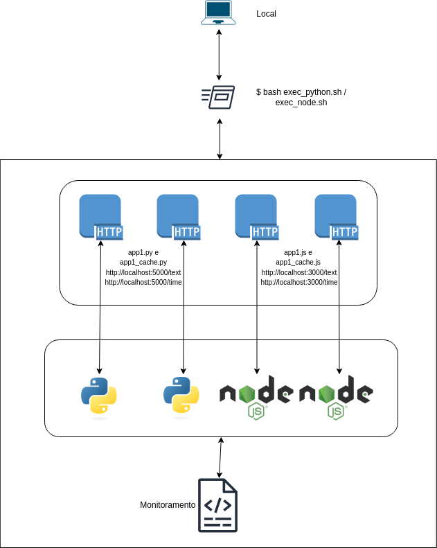

# Estrutura do Projeto APP_TEST/

- infra 
    - infra.drawio.png - desenho da arquitetura inicial

- python/ – app e arquivos Python + executavel  (app1.py, app1_cache.py,  requirements.txt, exec_python.sh)
    - app1.py - Duas rotas sem cache com debug para debug ativo para monitoramento e visualização dos logs.
    - app1_cache.py - Duas rotas com caches, rota /text com cache de 10 segundos e /time com cache de 60 segundos,  debug ativo para monitoramento e visualização de logs ( opção correta seria o logging, mas prefiro usar o debug no meu dia a dia para testes ).

- nodejs/ – app e arquivos Node.js + executavel (app1.js, app1_cache.js, package.json, exec_node.sh)
    - app1.js - Duas rotas sem cache com console.log para monitoramento e visualização de logs.
    - app1_cache.js - Duas rotas com caches, rota /text com cache de 10 segundos e /time com cache de 60 segundos, console.log para monitoramento e visualização de logs.

- .gitignore – arquivos e pastas ignoradas 

- README.md – documentação do projeto

# Execução 

- Python.
    Executar exec_python.sh dentro da pasta ./python 
        Comando:  bash exec_python.sh

- NodeJS.
    Executar exec_node.sh dentro da pasta ./nodejs 
        Comando:  bash exec_node.sh

Obs.: 
    - Para instalação, caso não tenha python e nodejs localmente, existem linhas comentadas dentro dos arquivos .sh para auxiliar. 
    - Em ambos projetos a path /text esta configurada para finalizar em 30 segundos, antes de iniciar a path /time. Caso precise ou queira executar um a um basta descomentar a linha "execução sem timeout" nos respectivos arquivos. 

# Melhorias

- Informações e/ou atalhos para as paths /text e /time,  na chamada raiz do projeto ( localhost:3000 ou 5000 ).
- Criação imagems ( docker ) para facilitar o deploy em caso de uso de containers.
- Criação de um CI/CD ( adicionando tags no github para controle de versão ), testes e deploy para o Kubernetes, serverless ou similar ( SG nas chamadas - ex: https/ssl, fw ... )
- Melhoria no monitoramento e observabilidade com informações não só da aplicação como do ambiente todo ( prometheus, opentelemetry, apmserver, dashboard ...).
